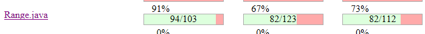

**SENG 438 - Software Testing, Reliability, and Quality**

**Lab. Report \#4 – Mutation Testing and Web app testing**

| Group \#:        |     |
| --------------   | --- |
| Student Names:   |     |
| Chun-chun Huang  |     |
| Amneet Deol      |     |
| Hiten Mahal      |     |
| Shreosi Debnath  | 30111867 |

# Introduction
This lab focused on mutation and GUI testing. With mutation testing we analyzed our test cases from assignment 3 through PiTest, identifying the mutants that were killed, survived, or were not covered at all. By adding to our test suite and targetting specific mutants, we were able to improve coverage and the number of killed mutants. With the GUI testing, we used Selenium and Sikulix. The Selenium IDE allowed us to automoate scripted tests for the IKEA website and we then compared it to the Sikulix GUI software. 


# Analysis of 10 Mutants of the Range class

## Range.getCentralValue()

```java
public double getCentralValue() {
        return this.lower / 2.0 + this.upper / 2.0;
    }
```

1. getCentralValue : Replaced double division with multiplication → KILLED
2. getCentralValue : Replaced double division with multiplication → KILLED
3. getCentralValue : Replaced double addition with subtraction → KILLED
4. getCentralValue : replaced double return with 0.0d for org/jfree/data/Range::getCentralValue → KILLED

## Range.intersects()

```java
public boolean intersects(Range range) {
        return intersects(range.getLowerBound(), range.getUpperBound());
    }
```

5. intersects : replaced boolean return with false for org/jfree/data/Range::intersects → KILLED
6. intersects : replaced boolean return with true for org/jfree/data/Range::intersects → KILLED

## Range.contains()

```java
public boolean contains(double value) {
        return (value >= this.lower && value <= this.upper);
    }
```

7. contains : replaced boolean return with false for org/jfree/data/Range::contains → KILLED
8. contains : replaced boolean return with true for org/jfree/data/Range::contains → KILLED

9. contains : negated conditional → KILLED
10. contains : negated conditional → KILLED

# Report all the statistics and the mutation score for each test class

## RangeTest from assignment 3



- mutation score is 67%
- line coverage is 91%
- test strength is 73%

**DataUtilities Mutation Summary With old given Tests**


**DataUtilities Mutation Summary With Assignment 3 Tests**


**DataUtilities Mutation Summary With New Updated Tests**


# Analysis drawn on the effectiveness of each of the test classes

# A discussion on the effect of equivalent mutants on mutation score accuracy

Equivalent Mutants reduce the accuracy of the mutation score because the survival of a equivalent mutant does not indicate poor tests but will still result in a lower ratio of mutants to killed mutants. For example one equivalent mutant we found in DataUtilities was mutant 104. In the DataUtilities source code we have the following line as a part of equal():
`for (int i = 0; i < source.length; i++)`
And Mutant 104 replaces the `<` with `!=`. This does not change the functionality since in both cases the loop will iterate by 1 and eventually stop when `i==source.length` and since i is only ever iterated by 1, it will never go above source.length which means both loops are functionally equivalent and the mutant will survive. This mutant surviving will lower the mutant score despite it being functionally indentical to the expected behaviour.

# A discussion of what could have been done to improve the mutation score of the test suites

- For Range class, we lose most of the mutation score in the mutants called "changed condition boundary". However, the tool does not provide the detail of the mutant. Thus, we need to conduct deep analysis of some condition statement to cover almost every possible outcome to earn the score.

# Why do we need mutation testing? Advantages and disadvantages of mutation testing
Mutation testing is a technique which tests software by adding artificial faults or mutations, to the code and testing if the tests can find them. The goal is to identify weaknesses in the test suite and improve its effectiveness in detecting faults.

Advantages:

1.It helps to improve the overall quality of software testing. Mutation testing can help identify gaps in test coverage and find areas where the code may be susceptible to errors.
2.Identifies faulty code.
3.it reduces the cost of testing hence it is cost efficient to use.

Disadvantages:

1.Takes to much time
2.It requires a lot of computational resources. Therefore it can be hard to do for small scale projects without the acess to cloud.
3.Interpreting the results are difficult. It takes a lot of expertise and analysis to understand the test results.


# Explain your SELENUIM test case design process
For testing the website of IKEA there are these scenarios to consider-

1.Sign up with valid data: In this scenario, fill all the required field with valid data. Then check and verify if the website goes to the homepage.
2.Sign up with invalid data: enter invalid datas in the boxes and check to see if the website is showing appropriate error messeage.
3.Log in with valid credentials: Enter valid username and password.Verify that the user is redirected to the home page after login signed in to the personalized acoount
4.Log in with invalid credentials:  In this case, enter invalid username and password. Verify that appropriate error messages are displayed
5.Add to cart test: For this case, we added a bunch of items from the products to the cart to see if it updates properly. Later, items were removed from the cart to check if they are removing right.
6.Navbar test: In this instance, we clicked on all the items in the navbar to see if it was showing the right result and going to the right page by clicking on all of them.
7.product filtering: For this case, we serached up a furniture such as table and filtered the results to see if it was showing the correct results. 
8.wishlist: To test this, we added products on our wishlist and checked if they were updating and removing correctly.

# Explain the use of assertions and checkpoints
Assertions and checkpoints are features in Selenium that help test the website's functionality and performance. 

Assertions help testers to make sure that a web page is behaving as expected. They compare what the web page is actually doing to what it is supposed to be doing, such as checking that the page title is correct. If something is not working as it should, the test will fail and the testers will know that there is a problem.

Checkpoints help testers to see the current state of a web page during testing. They allow testers to check whether the different parts of the web page i.e. buttons, text boxes, media, navbar are working properly. For example, a checkpoint can check if a button is active or inactive. This can help testers to find problems with the website's design or functionality, such as if a button is not working correctly or an image is missing.

# how did you test each functionaity with different test data

# Discuss advantages and disadvantages of Selenium vs. Sikulix
Selenium and SikuliX are both tools used for automated testing. Selenium is used for testing web applications, while SikuliX is used for testing desktop applications. 

Advantages of Selenium:
1.Works with many programming languages and different web browsers.
2.Can be integrated with continuous testing and deployment tools.
3.Has a large community of users, so it's easy to find support and information.

Disadvantages of Selenium:
1.do not support non-web-based applications.
2.Has limited support for image/video recognition. Therefore can be hard to test out media files.

Advantages of SikuliX:
1.Can recognize images on the desktop and simulate mouse and keyboard actions based on image recognition.
2.Easy to use with a graphical interface.
3.Can be used on different operating systems.
4.Requires no programming knowledge.

Disadvantages of SikuliX:
1.Sikulix is primarily designed for desktop applications and is not be suitable for testing web based applications or websites.
2.Due to a smaller community of users than Selenium it is hard to find information.

# How the team work/effort was divided and managed

# Difficulties encountered, challenges overcome, and lessons learned

# Comments/feedback on the lab itself
